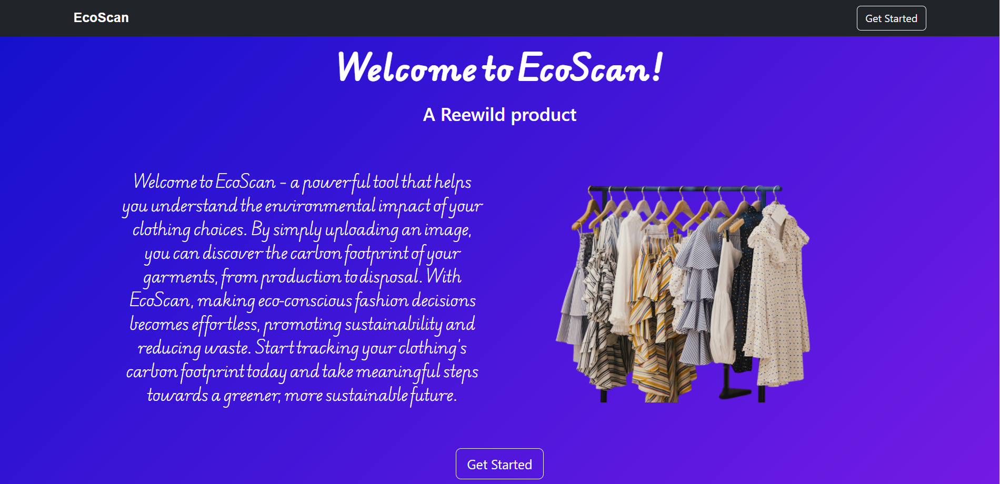
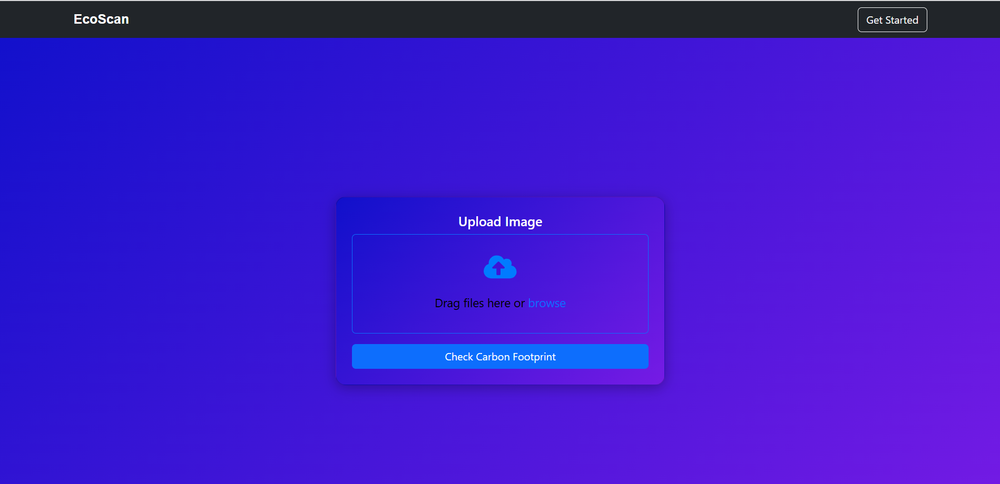
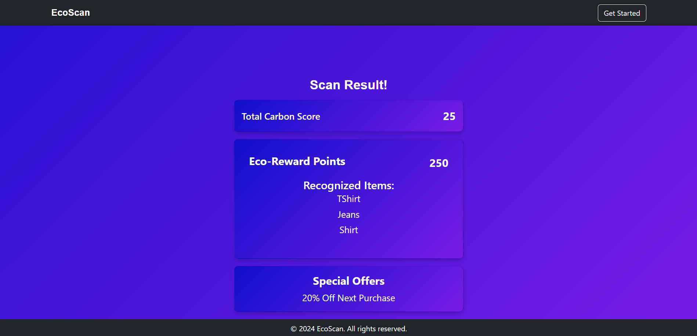

# EcoScan

## Visit the App
[Click here to visit the Ecoscan React App](https://eco-scan-challenge-lalit.vercel.app/)

## Introduction

**Welcome to EcoScan** – a powerful tool that helps you understand the environmental impact of your clothing choices. By simply uploading an image, you can discover the carbon footprint of your garments, from production to disposal. With EcoScan, making eco-conscious fashion decisions becomes effortless, promoting sustainability and reducing waste. Start tracking your clothing’s carbon footprint today and take meaningful steps towards a greener, more sustainable future.

## Features
- **Image Upload**: Users can upload images via file upload or direct camera capture.
- **Clothing Recognition**: Identifies clothing items and displays relevant details.
- **Carbon Footprint Calculation**: Calculates carbon scores based on item type and material.
- **Eco-Reward Points**: Provides points based on the environmental impact of clothing choices.
- **Offers & Discounts**: Displays available eco-friendly offers based on user activity.

## Technologies

iNotebook is built using a variety of technologies, including:

- **Frontend**:
  - React (for building the user interface)
  - React Router (for navigation)
  - Bootstrap CSS and JavaScript (for responsive and attractive styling)
  - **Upload Image**: Select or capture an image of your clothing item.
   
  - **Get Results**: After processing, the app provides carbon scores and eco-reward points.
   

- **Backend**:
  - Node.js with Express for API development

- **Mocked GPT-4 Response**: 
  - Simulated GPT-4-based image recognition for item categorization.

## How to Use:
1. **Upload Image**: Select an image from your device or capture one using your camera.
2. **View Carbon Footprint**: After processing, the app displays the carbon score of the item.
3. **Explore Offers**: Find eco-friendly offers based on your choices.

## Acknowledgments

Thanks to the developers of React, NewsApi, React Router, and Bootstrap for providing excellent tools and libraries. Your contributions to the open-source community have greatly benefited the development of **EcoScan**.
